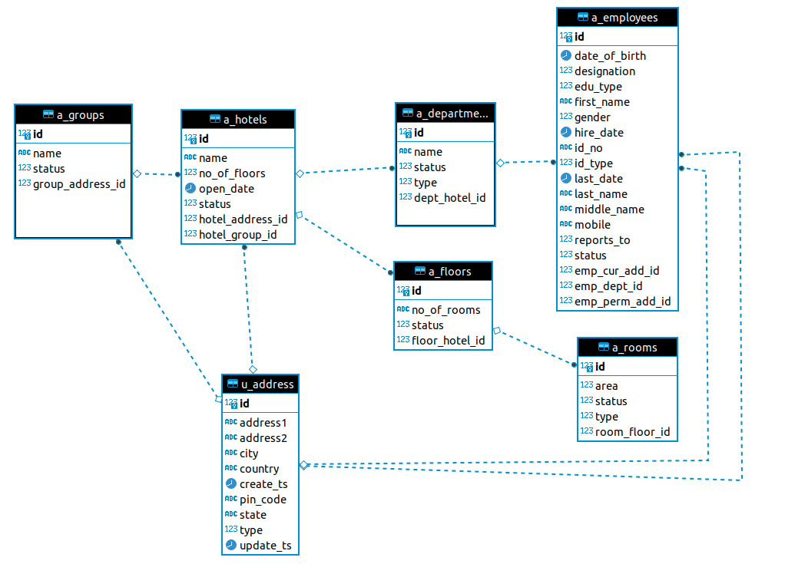

# Hotel Management API    

## Description

Hotel Management API is built for groups who have list or a single hotel. It has two modules as mentioned below

1. Admin Module
2. HMS Portal

**Admin Module**: In this module users with admin role can define a group under which hotels can be created. Below-mentioned are the list of masters developed for HMS API
1. Group Master      : In this master an admin user can create/modify/browse/delete a group.After successful creation of group, system will generate a unique group id. Ex: Taj Group of Hotels
2. Hotel Master      : For the created group id, admin user can create n number of hotels for that group.
3. Floor Master      : A hotel contains a list of floors. After creation of hotel, admin user can create list of floors under a hotel.
4. Room Master       : Rooms must be added for a created floor.
5. Department Master : Departments must be created for a specific hotel. 
6. Employee Master   : Employees will be working in various departments in a hotel in a particular department.
7. Inventory Master  : Details of products available in a hotel.

**HMS Portal**: In this module hotel employees can do the following activities mentioned below.
1. Login/Logout to the portal
2. Check-in/Check-out master
3. Manage Bookings
4. Manage different services available for a room once it is booked by the customer. Ex: Laundry Service

## ER Diagram

Follow me on Twitter 
